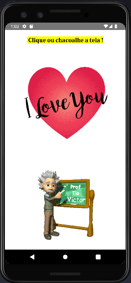
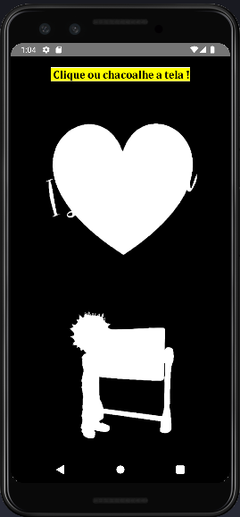

<<<<<<< HEAD

 

<H1>Projeto ReactNativeFlashLight </H1>
=======
# <a href="./readme.md">  Project ReactNativeFlashLight </a>

# <a href="./leiame.md">  Projeto ReactNativeFlashLight </a>
>>>>>>> 6255b24ae21396cd892805622393ad83c86dd878

# Dio-flashlight

  
 
## Construindo um app usando o sensor de movimento com React Native - 2022
 
Apk usando o sensor de movimento com React Native para acender e apagar a lanterna.
 
 
## Tecnologia 
 
Aqui estão as tecnologias usadas neste projeto
 
* Visual Studio Code com as seguintes bibliotecas:
  - Libs react-native-shake 
  - react-native-torch
  - StyleSheet
  - Hook useState
  - Hook useEffect
  - Add Listener to RNShake
  - Lifecicly ReactJS

## Como usar
 
Baixe o Apk: https://github.com/vicssb/reactNativeFlashLight/releases/download/v1.3.0/app-release.apk e instale no seu dispositivo.
 
## Resultados
 

 
 
 

 
 
## Links
 
  - DIO: https://www.dio.me/
  
  - Repositório: https://github.com/vicssb/reactNativeFlashLight
    - Em caso de bugs sensíveis, como vulnerabilidades de segurança, entre em contato
      diretamente em vez de usar o rastreador de problemas. Valorizamos o seu esforço
      para melhorar a segurança e privacidade deste projeto!
 
 
## Versão
 
1.3.0
 
 
## Autor
 
* **Victor Sérgio Silva Barros**: 

  

  

  

  
  

Por favor, siga o github e junte-se a nós!
Obrigado por me visitar e boa codificação!

